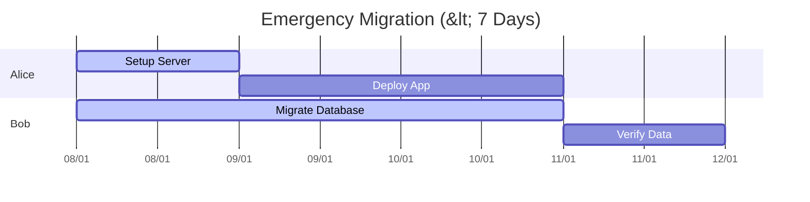
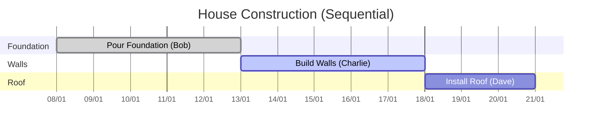

# 🚀 AI-PLAN-PRO-API

**AI-PLAN-PRO-API** is an intelligent project planning engine powered by **CrewAI** and **GPT-4o**. It takes a simple project goal and automatically generates a detailed, resource-aware schedule with logical dependencies.

---

## 🛠️ Installation

### 1. Clone the Repository
```bash
git clone https://github.com/wirat0155/AI-PLAN-PRO-API.git
cd AI-PLAN-PRO-API
```

### 2. Setup Environment
Create a `.env` file in the root directory and add your OpenAI API Key:
```bash
# .env
OPENAI_API_KEY=sk-proj-xxxx...
OPENAI_MODEL_NAME=gpt-4o
```
*(Make sure `OPENAI_MODEL_NAME` is uncommented to use the smart scheduler!)*

### 3. Install Dependencies
```bash
pip install -r requirements.txt
```

---

## ▶️ Running the API

Start the FastAPI server:
```bash
python main_api.py
```
*The server will start at `http://0.0.0.0:8000`*

---

## 🧪 Test Cases (Visualized)

You can test the API using Postman or `curl`. The endpoint is `POST /plan`.

### Scenario 1: 🚨 Urgent Deadline (Constraint)
**Goal:** Force the AI to parallelize tasks to meet a tight deadline.

**Request:**
```json
{
  "project_name": "Emergency Server Migration",
  "description": "Must be completed within 7 days (Urgent). System is crashing.",
  "team_composition": [
    {"role": "DevOps Engineer", "name": "Alice"},
    {"role": "Backend Dev", "name": "Bob"}
  ]
}
```

**Expected Outcome:**

*The AI schedules Bob and Alice to work **in parallel** to finish quickly.*

---

### Scenario 2: 🗓️ Future Start Date
**Goal:** Plan a project that starts in the future (e.g., "Start next month").

**Request:**
```json
{
  "project_name": "Q3 Marketing Campaign",
  "description": "Start this project next month (1st of next month).",
  "team_composition": [
    {"role": "Marketing Specialist", "name": "Carol"},
    {"role": "Designer", "name": "Dave"}
  ]
}
```

**Expected Outcome:**
- **Start Date**: NOT today. It will be the 1st of next month.
- **Schedule**: All sub-tasks shift accordingly.

---

### Scenario 3: 🏗️ Logical Sequencing (Dependencies)
**Goal:** Ensure logical order (Foundation -> Walls -> Roof) is respected, even with multiple workers.

**Request:**
```json
{
  "project_name": "Build a Small House",
  "description": "Standard construction. foundation -> walls -> roof.",
  "team_composition": [
    {"role": "Builder", "name": "Bob"},
    {"role": "Builder", "name": "Charlie"},
    {"role": "Roofer", "name": "Dave"}
  ]
}
```

**Expected Outcome:**

*Notice "Roof" starts **after** "Walls", even though Dave (Roofer) was free earlier. The AI understands gravity!*
